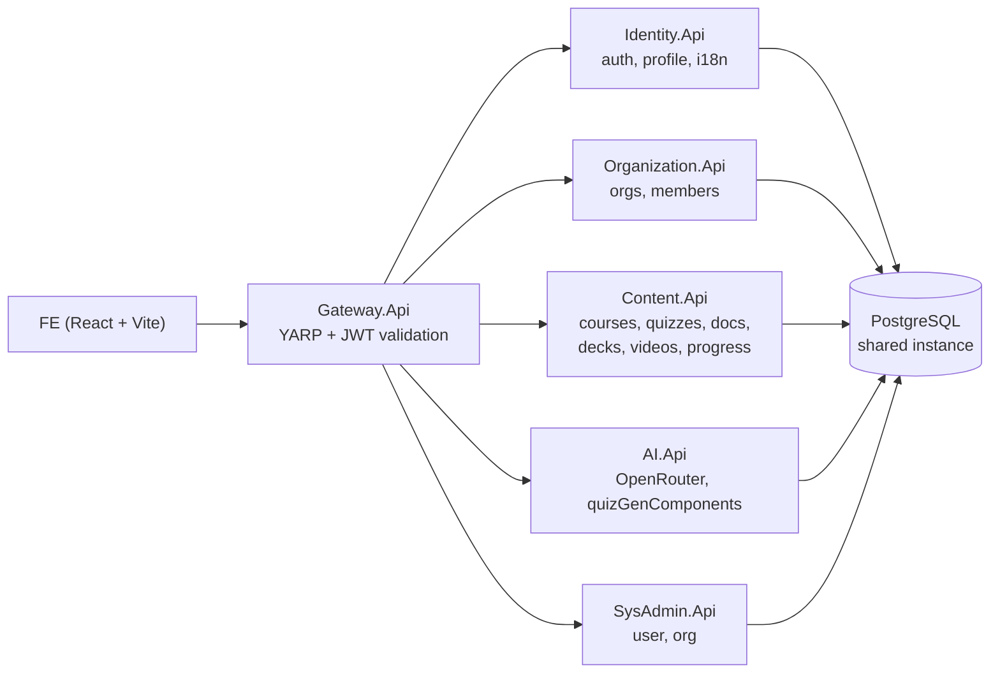

# Lumina LMS

Lumina is a multi-tenant Learning Management System: users build a personal, publicly shared catalog of study material (Quizzes, Documents, Flashcard Decks, YouTube-linked Videos), and Organizations run Courses on top of that catalog with per-course Teacher/Student roles, approval-based enrollment, and AI-generated quizzes.

The system is spec-driven — every feature in this repo traces back to a line in [`SystemDoc/System_specification`](SystemDoc/System_specification), which is treated as the immutable source of truth during development.

**Demo video:** [https://youtu.be/OtJFF_H0Lkc](https://youtu.be/OtJFF_H0Lkc)

## Contents

- [Roles](#roles)
- [Core features](#core-features)
- [Architecture](#architecture)
- [Tech stack](#tech-stack)
- [Repository layout](#repository-layout)
- [Getting started](#getting-started)
- [Seed accounts](#seed-accounts)
- [Testing](#testing)
- [Project status](#project-status)

## Roles

Lumina decouples **global identity roles** (encoded in the JWT) from **per-course roles** (resolved server-side, never trusted from a token):

| Role | Scope | Notes |
|---|---|---|
| **User** | Global | Default account. Creates public learning resources, joins organizations, requests course enrollment. |
| **OrgAdmin** | One Organization | Manages courses, members, and per-course role assignment for the org they created/own. Has implicit Teacher rights in every course of that org. |
| **SysAdmin** | Platform-wide | Organization CRUD, global user management, AI key/quota config, banner management, absolute content deletion, organization suspension. Cannot self-register or use SSO — provisioned only by another SysAdmin. |
| **Teacher / Student** | One Course | *Not* organization-level roles. Stored per-row in `course_enrollments.role`, computed dynamically by `CourseAccessService` on every request. A user can be Teacher in Course A and Student in Course B simultaneously. |

Organization-level membership is limited to `Owner | OrgAdmin | Member` — Teacher/Student only exists inside a course context.

## Core features

- **Unified registration & SSO** — single `/register` form with an explicit role selector (User vs. OrgAdmin); Google/Microsoft OAuth2 for User and OrgAdmin, with a first-login role-selection intermediary page. SysAdmin has a dedicated, SSO-free login portal.
- **Personal learning catalog** — Quiz, Document, Flashcard Deck, and YouTube Video creation, always public, with clone-to-own-copy support and author attribution on every public search result.
- **AI-assisted quiz generation** (`stepfun/step-3.5-flash` via OpenRouter) — generates quizzes from a user's own document, constrained to zero-hallucination, language-matched to the source document, explanation-mandatory per question, and saved as a `Draft` for human review before publishing. Per-organization quota tracked and reset by a scheduled job.
- **Collections** — personal, public groupings of mixed resource types, with nested sub-collections via `parent_id`.
- **Courses** — org-scoped, each auto-seeded with 3 default modules on creation; self-service enrollment requests (`Pending → Approved/Rejected`) that atomically add the approved user as an org `Member`; direct OrgAdmin-driven enrollment bypasses the approval step.
- **Progress tracking** — `student_progress` rows are written automatically as a side effect of viewing content or submitting a quiz; the client never sets them directly.
- **i18n** — Vietnamese / Japanese / English, runtime-switchable, persisted on the user profile.
- **SysAdmin governance** — global "Absolute Deletion" right on any resource, and per-organization Suspend/Reactivate that immediately locks all read/teach access to that org's courses.

Full behavioral detail (validation rules, atomic-transaction requirements, endpoint contracts) lives in [`SystemDoc/System_specification`](SystemDoc/System_specification).

## Architecture

Microservices on **ASP.NET Core 9**, fronted by a **YARP** reverse-proxy gateway that performs JWT validation and routing. All services connect to a single shared **PostgreSQL** database; each service owns its own tables/DbContext and tenant isolation is enforced entirely at the application layer (`org_id` / `organization_members` / `course_enrollments` filters on every query) rather than by physical database separation.



Each service owns its own EF Core migrations; there are no cross-service SQL joins — inter-service reads go over HTTP through the gateway or internal endpoints defined in `Shared.Contracts`.

## Tech stack

**Backend:** ASP.NET Core 9, EF Core, YARP, PostgreSQL, Hangfire (scheduled quota reset), JWT + refresh-token auth (SHA-256 hashed, rotated on refresh), OpenRouter (`stepfun/step-3.5-flash`), YouTube Data API v3.

**Frontend:** React 18 + TypeScript (strict) + Vite, React Router, Tailwind CSS (design system ported from TailAdmin), Context-based auth/org/toast state.

**Testing:** pytest + `requests` (API use-case tests), pytest + Playwright (FE display + E2E workflows), Katalon Recorder as an authoring aid for E2E scripts ported into pytest.

## Repository layout

```
BE/
├── Gateway.Api         (5000)  YARP reverse proxy, JWT validation
├── Identity.Api        (5001)  auth, JWT + refresh tokens, profile, i18n pref
├── Organization.Api    (5002)  orgs, members, OrgAdmin scope
├── Content.Api         (5003)  courses, modules, quizzes, documents, decks, videos, progress, collections
├── AI.Api              (5004)  OpenRouter integration, quota, Hangfire reset job
├── SysAdmin.Api        (5005)  banners, AI key config
└── Shared.Contracts            DTOs, validators, env helpers

FE/                             Vite + React + TS + Tailwind (port 5173)
SystemDoc/                      Immutable functional spec — source of truth for every feature
tests/                          pytest suites: api/, ui/, e2e/, katalon/, fixtures/
start-local.ps1                 One-shot setup + start script for the full stack
```

## Getting started

Prerequisites: .NET 9 SDK, Node.js, PostgreSQL running locally, and an OpenRouter API key for AI quiz generation.

**Option A — one-shot script (Windows / PowerShell):**

```powershell
.\start-local.ps1                # smart setup + start every service
.\start-local.ps1 -SkipSetup     # skip restore/build/npm install, just start
```

**Option B — manual, one service at a time:**

```powershell
dotnet restore BE/BEDoAn.sln
dotnet build BE/BEDoAn.sln

dotnet run --project BE/Gateway.Api
dotnet run --project BE/Identity.Api
dotnet run --project BE/Organization.Api
dotnet run --project BE/Content.Api
dotnet run --project BE/AI.Api
dotnet run --project BE/SysAdmin.Api

cd FE
npm install
npm run dev          # http://localhost:5173
```

Required environment (Postgres connection strings, OpenRouter key, JWT signing key, YouTube API key) is documented in [`tests/README.md`](tests/README.md).

## Seed accounts

The database seeds deterministic test accounts on startup (`[role][N]` / `[role]@123`):

| Account | Password | Role | Login |
|---|---|---|---|
| SysAdmin1 / SysAdmin2 | `SysAdmin@123` | SysAdmin | `/admin/login` (dedicated portal, no SSO) |
| OrgAdmin1 | `OrgAdmin@123` | OrgAdmin of TestOrg1 (`aaaaaaaa-aaaa-aaaa-aaaa-aaaaaaaaaaaa`) | `/login` with Org ID |
| OrgAdmin2 | `OrgAdmin@123` | OrgAdmin of TestOrg2 (`bbbbbbbb-bbbb-bbbb-bbbb-bbbbbbbbbbbb`) | `/login` with Org ID |
| User1 / User2 / User3 | `User@123` | User (Student) | `/login`, no Org ID |

## Testing

Testing is treated as proof of behavior, not an afterthought: a feature is only "done" once a use-case test passes against the **running stack**, not just in isolation.

```powershell
cd tests
pip install -r requirements.txt
python -m playwright install chromium
python run_tests.py                 # verifies Gateway (5000) + FE (5173) are up, runs everything

pytest -m "wave1 and user"          # slice: Wave 1 User
pytest -m "display and sysadmin"    # slice: FE display tests for SysAdmin
pytest -m "e2e"                     # full browser workflows
```

`run_tests.py` runs the API, UI, E2E, and Katalon suites in sequence and emits a combined HTML report plus a `summary.json` keyed by spec section. Last recorded full run (2026-05-23): **447/447** passing (90 API + 37 UI + 320 Katalon/E2E), including all 46 non-functional-requirement tests — usability, maintainability, availability, compatibility (see [`SystemDoc/NFR_Testcase_Results.md`](SystemDoc/NFR_Testcase_Results.md)). Coverage has grown since through further fix rounds tracked in the git history.

## Project status

Implementation proceeds in strict waves — Wave 1 (User + SysAdmin) fully green before Wave 2 (OrgAdmin) begins. Several post-Wave-2 fix rounds (course enrollment lifecycle, per-course role visibility, content-creation flow) were done ahead of a pending `SystemDoc` update.

CI/CD is not yet wired up — the test suites above currently run manually against a locally started stack.
